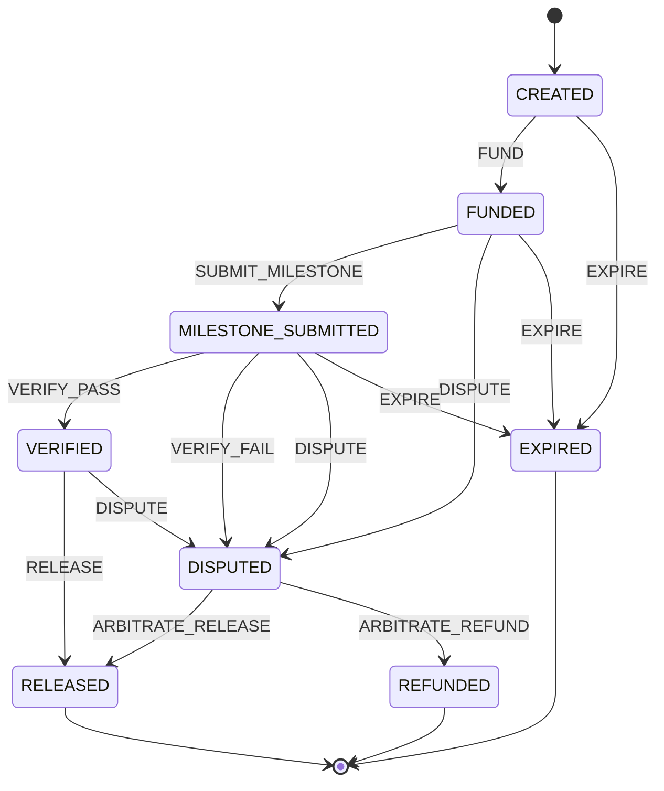

# escrow-state-machine-ts

Deterministic escrow fund-release state machine + campaign fee calculator,
reproduced from the **ALLWEB3** portfolio case study (three-sided Web3 growth
marketplace: creators, campaign managers, governance admins; escrow release
anchored to oracle-verified KPIs).

TypeScript, zero runtime dependencies. The case study's on-chain contracts are
*not* included here — this is the off-chain logic: who can move money, when,
and exactly how the numbers are computed.

## Install

Node.js ≥ 20.

```bash
npm install
npm run build
npm test   # 39 tests, all local
```

## Quickstart

```ts
import { Escrow, calculateDeposit, settleRelease } from "./dist/index.js";

// 1. Deterministic fee preview (numbers from the case study)
const fees = calculateDeposit({
  creatorPool: 10000,
  baseFee: 600,
  complexityMultiplier: 1.0,
  loyaltyDiscount: 30,
  oracleFee: 60,
});
console.log(fees.deposit); // 10630

// 2. Milestone escrow lifecycle
const escrow = new Escrow("CMP-2026-042");
escrow.dispatch("FUND", "wire received", 10630); // optional amount: FUND-only,
// validated as a finite non-negative number and recorded on the audit entry
escrow.dispatch("SUBMIT_MILESTONE", "deliverable URLs + IPFS metadata hash");
escrow.dispatch("VERIFY_PASS", "KPIs validated by oracle");
escrow.dispatch("RELEASE");
console.log(escrow.state); // RELEASED

// 3. Gross-to-net settlement on release (5% pro fee)
console.log(settleRelease({ gross: 1000, proFeeBps: 500 }));
// { gross: 1000, proFee: 50, referralCredits: 0, net: 950 }
```

## State machine



(`EXPIRE` is available from `CREATED`, `FUNDED`, and `MILESTONE_SUBMITTED`
once the campaign deadline passes — not from `VERIFIED`/`DISPUTED`, where the
outcome is decided by verification or arbitration; terminal states are
`RELEASED`, `REFUNDED`, `EXPIRED`. The diagram matches `transitionTable()` in
`src/stateMachine.ts` exactly — see `test/stateDiagram.test.ts`, which asserts
parity.)

- `transition(state, event)` is a pure function; invalid transitions throw.
- `Escrow` wraps it with an append-only history (the case study's "immutable
  operational audit log"): every dispatch records seq, event, from → to,
  timestamp, and an optional note. `FUND` accepts an optional `amount`
  argument — it is validated as a finite non-negative number at the dispatch
  boundary (anything else throws) and recorded on the audit entry; passing an
  amount with any other event throws.
- `allowedEvents(state)` lists valid next events for UI gating.

## FAQ (honest)

- **Is this a smart contract?**
  No. This is pure TypeScript with zero runtime dependencies, running on
  Node.js ≥ 20. It reproduces the *off-chain* transition rules from the
  ALLWEB3 portfolio case study. There is no Solidity, no EVM bytecode, and
  no on-chain state here.

- **Where does the fee formula come from?**
  From the case study's "Deterministic Fee Calculator & Escrow Preview":
  `deposit = creatorPool + baseFee × complexityMultiplier − loyaltyDiscount + oracleFee`.
  The golden vector (10,000 / 600 / 1.0 / −30 / +60 → 10,630) is asserted by
  `test/economics.test.ts`. It is the case study's formula, not a general
  pricing engine.

- **The case study anchors settlement in Chainlink + zk-SNARK + TEE
  verification. Where is that here?**
  It isn't — deliberately. "Verification" here is the `VERIFY_PASS` event:
  dispatching it is a caller trust decision. This repo does *not* verify
  oracle signatures, zero-knowledge proofs, or TEE attestations. A production
  build would have to gate `VERIFY_PASS` on those.

- **What about the 5/9 multi-sig DAO arbitration?**
  Also modeled, not implemented: `DISPUTE` → `ARBITRATE_RELEASE` /
  `ARBITRATE_REFUND`. There is no multi-sig quorum logic, no signatures, and
  no DAO governance in this repo.

- **How precise is the money math?**
  All amounts are rounded to cents (`round2`). Invariant tests assert fund
  conservation within ±1 cent. This is not big-decimal arithmetic and has
  not been audited.

- **Can I use this in production?**
  No. `Escrow` is in-memory (no persistence, no concurrency control, no
  idempotency keys), `EXPIRE` is dispatched by the caller (there is no
  deadline scheduler), and there is no identity/RBAC. Reference and demo
  use only.

## Limitations (honest)

- **Off-chain reproduction only.** The case study anchors settlement in smart
  contracts (Chainlink + zk-SNARK + TEE verification, 5/9 Safe multi-sig
  arbitration). None of that is implemented here — this models the *rules*,
  not the chain.
- **Simplified roles.** Real deployments need identity/RBAC, deadline
  scheduling, and idempotency keys; the `Escrow` class is in-memory.
- **Fee formula is the case study's**, not a general pricing engine: arbitrary
  fee schedules are out of scope.

## Reproducibility

`npm test` runs 39 tests, including the portfolio's exact fee numbers as a
golden vector (10,000 / 600 / 1.0x / −30 / +60 → 10,630). No network, no
randomness in assertions.

## License

MIT
