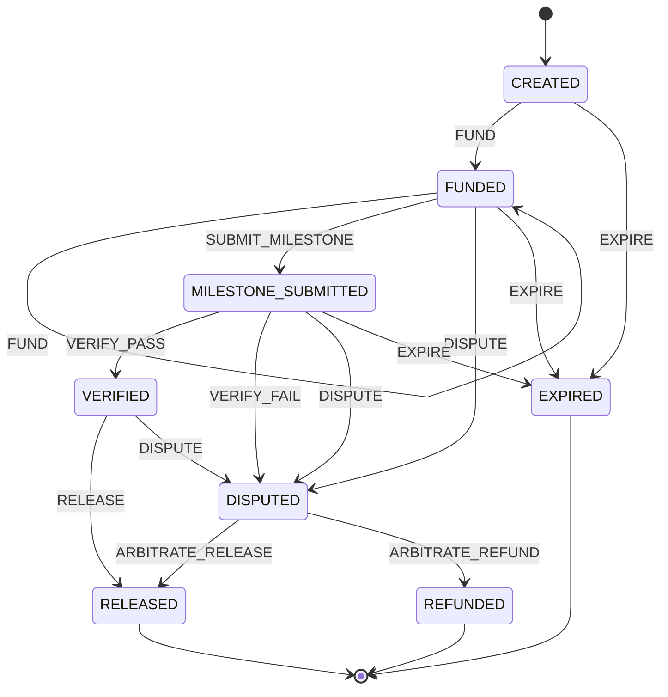

# escrow-state-machine-ts

Deterministic escrow fund-release state machine + campaign fee calculator,
reproduced from the **ALLWEB3** portfolio case study (three-sided Web3 growth
marketplace: creators, campaign managers, governance admins; escrow release
anchored to oracle-verified KPIs).

TypeScript, zero runtime dependencies. The case study's on-chain contracts are
*not* included here — this is the off-chain logic: who can move money, when,
and exactly how the numbers are computed.

## Install

Node.js ≥ 20.

```bash
npm install
npm run build
npm test   # 479 tests, all local
```

## Quickstart

```ts
import { Escrow, calculateDeposit, settleRelease } from "./dist/index.js";

// 1. Deterministic fee preview (numbers from the case study)
const fees = calculateDeposit({
  creatorPool: 10000,
  baseFee: 600,
  complexityMultiplier: 1.0,
  loyaltyDiscount: 30,
  oracleFee: 60,
});
console.log(fees.deposit); // 10630

// 2. Milestone escrow lifecycle
const escrow = new Escrow("CMP-2026-042");
escrow.dispatch("FUND", "wire received", 10630); // optional amount: FUND-only,
// validated as a finite non-negative number and recorded on the audit entry
escrow.dispatch("SUBMIT_MILESTONE", "deliverable URLs + IPFS metadata hash");
escrow.dispatch("VERIFY_PASS", "KPIs validated by oracle");
escrow.dispatch("RELEASE");
console.log(escrow.state); // RELEASED

// 3. Gross-to-net settlement on release (5% pro fee)
console.log(settleRelease({ gross: 1000, proFeeBps: 500 }));
// { gross: 1000, proFee: 50, referralCredits: 0, net: 950 }
```

## State machine



(`EXPIRE` is available from `CREATED`, `FUNDED`, and `MILESTONE_SUBMITTED`
once the campaign deadline passes — not from `VERIFIED`/`DISPUTED`, where the
outcome is decided by verification or arbitration; terminal states are
`RELEASED`, `REFUNDED`, `EXPIRED`. The diagram matches `transitionTable()` in
`src/stateMachine.ts` exactly — see `test/stateDiagram.test.ts`, which asserts
parity.)

- `transition(state, event)` is a pure function; invalid transitions throw.
- `Escrow` wraps it with an append-only history (the case study's "immutable
  operational audit log"): every dispatch records seq, event, from → to,
  timestamp, and an optional note. Each entry is also **hash-chained**:
  `prevHash` links to the previous entry's `hash` (genesis links to the
  `"GENESIS"` constant) and `hash` is SHA-256 over the canonical entry
  serialization, so a rewritten entry in a persisted JSON snapshot is
  detectable — `verifyHistoryChain(history)` returns `false`, and
  `Escrow.fromJSON()` rejects a broken chain, and `buildSettlementReport()`
  verifies the chain before producing any accounting (legacy hashless
  snapshots are still accepted and chained on rehydration; mixed
  chained/hashless snapshots are rejected). By default the chain is unkeyed tamper *evidence*, not a
  MAC — see [SECURITY.md](SECURITY.md) for the honest limits. An optional
  keyed mode upgrades it to a real MAC: construct the escrow with
  `new Escrow(id, { auditKey })` and every link becomes HMAC-SHA256 under
  that key, so a full-log rewrite with recomputed hashes is detected
  without the key. Verification is fail-closed across modes (a keyed
  chain needs its key via `verifyHistoryChain(history, key)` /
  `Escrow.fromJSON(snapshot, { auditKey })`; an unkeyed chain rejects a
  supplied key), and the key is never written into snapshots.
  `FUND` accepts an optional `amount`
  argument — it is validated as a finite non-negative number at the dispatch
  boundary (anything else throws) and recorded on the audit entry; passing an
  amount with any other event throws. `FUND` from `CREATED` is the initial
  deposit; `FUND` from `FUNDED` is a self-loop that adds a top-up to the
  locked total — real escrows often need extra collateral, and the locked
  total is always the *sum* of every `FUND` entry's amount (see
  `depositAmountFromHistory`).
- `allowedEvents(state)` lists valid next events for UI gating.
- Retry safety: `dispatch` accepts a fourth argument `opts` with an optional
  `idempotencyKey` (non-empty string). A dispatch whose key was already seen
  is a no-op — it returns the *current* state and appends nothing to the
  audit history, so a retried `FUND` can never double-count the deposit.
  Keys are global to the escrow instance (the same key on a different event
  is still a duplicate), are recorded only after a *successful* dispatch (a
  failed dispatch leaves the key unused, so the caller can retry with
  corrected input), and ARE part of `toJSON()`/`fromJSON()` snapshots: the
  consumed set rides along as `idempotencyKeys` (written only when
  non-empty, so a keyless snapshot keeps its legacy shape), and a restored
  escrow still treats an already-consumed key as a duplicate — replays stay
  exactly-once across restarts as long as snapshots are persisted through
  `toJSON()`. This is per-escrow retry protection, not a distributed
  idempotency store: two processes restoring the same snapshot
  independently can each execute the same key once.
- Injectable audit timestamps: `dispatch` opts also accept `at`
  (`Date | string`) to pin the audit entry's timestamp — for deterministic
  dispatch tests and replay (quorum approvals and webhook payloads already
  had injectable clocks; the audit clock did not). A `Date` is normalized
  via `toISOString()`; a string must already be canonical ISO-8601 (the
  same rule snapshot validation enforces) and must not be earlier than the
  previous entry's `at`. Invalid or backwards values throw before anything
  is appended, and a rejected dispatch consumes no idempotency key. When
  omitted, the wall clock is used as before. The injected value is covered
  by the entry's hash chain like every other field.
- Deposit caps: `new Escrow(id, { maxDeposit })` caps the total locked
  deposit at a finite non-negative number (risk control / contract limits).
  A `FUND` whose amount would push the locked total — the sum of every
  `FUND` entry's amount — above the cap throws a `deposit cap exceeded`
  error *after* transition and amount validation and appends nothing, so a
  failed FUND leaves no audit residue. `FUND` dispatches without an amount
  carry no money and are never capped. The cap is
  per-instance constructor configuration: it is NOT part of
  `toJSON()`/`fromJSON()` snapshots, so a restored escrow must re-enable it
  via `Escrow.fromJSON(snapshot, opts)`.
- Event-level RBAC (opt-in): `new Escrow(id, { rolePolicy })` maps events
  to the actor names allowed to dispatch them, e.g.
  `{ RELEASE: ["treasury"], ARBITRATE_RELEASE: ["dao-arbitrator"] }`.
  `dispatch` then requires `opts.actor` (a non-empty string, recorded on
  the audit entry and covered by its hash chain) to exactly match the
  allowlist for gated events — a missing or non-allowlisted actor throws
  `actor not authorized for …` after the transition-legality check and
  before anything is appended, and does not consume an idempotency key,
  so a retry with an authorized actor and the same key succeeds. Events
  the policy does not list are unrestricted, and an escrow with no policy
  behaves exactly as before. Invalid policies (unknown event, non-array
  value, empty array, empty/non-string actor name) throw
  `invalid option: rolePolicy …` at construction. Unlike the deposit
  cap, the policy IS part of `toJSON()`/`fromJSON()` snapshots
  (`rolePolicy`, only when non-empty; a tampered policy in a stored
  snapshot is rejected), and an explicit
  `Escrow.fromJSON(snapshot, { rolePolicy })` overrides the snapshot's
  policy entirely. Honest limit: this is a *caller-supplied allowlist*,
  not identity authentication — the caller asserts the actor string and
  nothing verifies who the caller is (see SECURITY.md).
- Optimistic concurrency (opt-in): `dispatch` opts accept `expectedSeq`
  — the history length (the last entry's `seq`; `0` for an empty
  history) the caller based its decision on. When set, the guard runs
  before every other dispatch check (option validation, the
  idempotency dedupe, transition legality, RBAC, amount/cap): a
  mismatch throws
  `dispatch conflict: expected seq <n> but escrow is at seq <m>` and
  changes nothing — no state move, no history entry, no idempotency
  key consumed, no listener notified — so two writers racing off the
  same snapshot cannot both advance the escrow, and the loser can
  re-read and retry with the fresh seq. A non-integer or negative
  value throws `invalid dispatch options: …`. Honest limit: this is a
  single-process optimistic lock only; two processes that each
  restored the same snapshot can still race, and cross-process writers
  need compare-and-swap in the durable store itself.
- Deadlines (advisory): `escrow.setDeadline(date)` attaches a deadline
  (stored as canonical ISO-8601; unparseable input throws),
  `getDeadline()`/`clearDeadline()` read and remove it. The deadline is
  *advisory*: nothing auto-expires — a watchdog (or a human) reads
  `isOverdue(escrow)` and dispatches `EXPIRE` explicitly, so expiry stays
  auditable in the append-only history. `isOverdue()` returns false with
  no deadline and for terminal states (a settled escrow is never
  "overdue"). `expiredEscrows(escrows)` filters a batch down to the
  overdue non-terminal ones in one line — it never mutates or dispatches.
  `expireOverdueEscrows(escrows)` goes one step further and performs the
  explicit `EXPIRE` dispatch per overdue escrow, returning per-escrow
  `{ escrow, expired, error? }` outcomes. The executor exists because of a
  real trap: `VERIFIED` (and `DISPUTED`) escrows have no `EXPIRE` edge in
  the transition table, so a naive hand-written loop aborts the whole
  batch on the first such escrow — the executor records
  `{ expired: false, error: "invalid transition: EXPIRE from VERIFIED" }`
  for it and keeps going. Failed escrows are left untouched.
  The deadline rides along in `toJSON()`/`fromJSON()` snapshots (a
  tampered or non-canonical deadline is rejected by snapshot validation).
  A distinct screening is `staleEscrows(escrows, maxAgeByState, now?)`:
  where the deadline helpers ask "past an *absolute* deadline", it asks
  "stuck in the *current state* too long" — dwell is measured from the
  last history entry's `at`, against a per-state millisecond budget,
  and an escrow is stale only when dwell is *strictly* past its state's
  budget (terminal states never qualify, states with no budget are
  ignored, and an escrow with no history has no measurable dwell). A
  FUNDED escrow whose milestone nobody submits for 30 days is picked
  up here even when its deadline is months away. It is a pure filter
  with deliberately *no* executor companion: expiry is the single
  obvious action for an overdue escrow, but a stale escrow's right
  disposition — notify the parties, escalate to arbitration, or expire
  it — is a state-dependent caller decision.
- Dispatch subscriptions (in-process fan-out seam): `escrow.subscribe(listener)`
  registers a listener called with `(event, from, to, entry)` after every
  *successful* dispatch, in subscription order; the returned function
  unsubscribes (idempotent). Listeners run *after* the audit entry is
  appended and can never roll it back — a throwing listener is isolated
  (its error is swallowed, remaining listeners still run, dispatch returns
  normally); pass `{ onError }` to observe those failures. The entry handed
  to listeners is a frozen, detached copy, so listeners cannot rewrite the
  audit trail. Failed dispatches and idempotency-key no-ops produce zero
  notifications. Subscriptions are in-memory only: they are NOT part of
  `toJSON()`/`fromJSON()` snapshots, and there is no durable fan-out
  (queues, webhooks, retries) — that stays the caller's infrastructure.
- Persistence-ready snapshots: `escrow.toJSON()` exports a plain-JSON
  `{ v, id, state, history }` snapshot (a detached deep copy;
  `JSON.stringify(escrow)` goes through it), and
  `Escrow.fromJSON(snapshot)` rebuilds a working escrow — the input is
  strictly validated as if untrusted (seq restarts at 1 with no gaps,
  from→to chain continuous from `CREATED`, every edge a legal transition,
  canonical ISO-8601 non-decreasing timestamps, `amount` finite and
  non-negative on FUND entries only); malformed snapshots throw a
  descriptive `invalid snapshot: …` error instead of yielding a corrupt
  escrow. Unknown fields are rejected fail-closed at both levels —
  top level allows only `v`/`id`/`state`/`history`/`deadline`/`idempotencyKeys`/`rolePolicy` and an
  entry only `seq`/`event`/`from`/`to`/`at`/`actor`/`note`/`amount`/`evidence`/
  `prevHash`/`hash` — so a typo like `deadlline` or `amout` throws
  `invalid snapshot: unknown field "…"` instead of silently losing a
  deadline or a FUND amount. Snapshots carry a schema version (`v: 1`): a missing `v` is a
  legacy pre-versioning snapshot and is still accepted, while any other
  `v` value throws `unsupported snapshot version` (checked before the
  history/hash-chain validation), so a future format change stays
  distinguishable from corruption. The consumed idempotency-key set is
  part of the snapshot (`idempotencyKeys`, only when non-empty; entries
  must be non-empty strings and duplicates are deduped on restore) —
  `v` stays 1 because the field is optional and additive: snapshots
  without it load exactly as before, but a snapshot *carrying* it is
  rejected as an unknown field by older parsers that predate it (an old
  binary must not silently drop replay protection). A snapshot is an *export*, not a datastore — there is still no
  built-in storage or locking.
- NDJSON audit-log streaming: `historyToNdjson(history | escrow)` /
  `historyFromNdjson(text)` (`src/ndjson.ts`) export and import *only
  the audit log* — one canonical JSON entry per line, line order =
  `seq` order, trailing newline, empty history exports to `""`. Use a
  snapshot when you need state + configuration restored; use NDJSON
  when the log itself should stream to disk or a log pipeline.
  Import is as strict as the snapshot parser (it runs through
  `parseEscrowHistory`, the same code path): seq from 1 with no gaps,
  from/to chain continuous, the hash chain re-verified — a tampered,
  deleted, or reordered line throws, a non-JSON line throws naming
  its 1-based line number, and empty/whitespace-only input throws
  (a missing log is not a log of zero events). CRLF input is
  accepted. Keyed (HMAC) histories need the same `auditKey` on
  import, and the key never appears in the text.

## FAQ (honest)

- **Is this a smart contract?**
  No. This is pure TypeScript with zero runtime dependencies, running on
  Node.js ≥ 20. It reproduces the *off-chain* transition rules from the
  ALLWEB3 portfolio case study. There is no Solidity, no EVM bytecode, and
  no on-chain state here.

- **Where does the fee formula come from?**
  From the case study's "Deterministic Fee Calculator & Escrow Preview":
  `deposit = creatorPool + baseFee × complexityMultiplier − loyaltyDiscount + oracleFee`.
  The golden vector (10,000 / 600 / 1.0 / −30 / +60 → 10,630) is asserted by
  `test/economics.test.ts`. It is the case study's formula, not a general
  pricing engine.

- **The case study anchors settlement in Chainlink + zk-SNARK + TEE
  verification. Where is that here?**
  It isn't — deliberately. "Verification" here is the `VERIFY_PASS` event:
  dispatching it is a caller trust decision. This repo does *not* verify
  oracle signatures, zero-knowledge proofs, or TEE attestations. A production
  build would have to gate `VERIFY_PASS` on those.

  What *is* supported is an auditable opt-in: `new Escrow(id, {
  requireVerifyEvidence: true })` makes `dispatch("VERIFY_PASS")` require a
  non-empty `evidence` reference (Chainlink request ID, zk proof commitment,
  TEE quote hash — passed via `DispatchOptions.evidence`) and records it
  verbatim on the audit entry, surviving `toJSON()`/`fromJSON()` round-trips.
  It turns "someone said pass" into "someone said pass, citing X" — the
  reference is auditable but still *not* verified by the library. The flag
  is per-instance dispatch configuration and is not part of the snapshot;
  a restored escrow must re-enable it via `Escrow.fromJSON(snapshot, opts)`.

- **What about the 5/9 multi-sig DAO arbitration?**
  Partially modeled: `DISPUTE` → `ARBITRATE_RELEASE` /
  `ARBITRATE_REFUND` are the arbitration outcomes, and `src/quorum.ts`
  models the *counting rule* of an M-of-N quorum (`createQuorum({ threshold,
  signers })`, idempotent `approve()`, `revoke()` before the threshold is
  reached, `hasQuorum()` — see the usage example
  in its JSDoc). `approvalLog()` records who approved and when
  (timestamps injectable via `QuorumConfig.now` for deterministic tests). `src/arbitration.ts` wires the two together:
  `dispatchArbitration(escrow, quorum, outcome)` refuses to dispatch until
  `hasQuorum()` is true and auto-records `quorum <approvals>/<threshold>`
  in the audit note. There is still no signature verification, no key
  management, and no DAO governance in this repo — recording approvals is a
  caller trust decision, exactly like `VERIFY_PASS`. Production would need
  the approvals wired to real signatures.

- **How precise is the money math?**
  All amounts are rounded to cents (`round2`). Invariant tests assert fund
  conservation within ±1 cent. This is not big-decimal arithmetic and has
  not been audited.

- **Can I use this in production?**
  No. `Escrow` is in-memory with no built-in store (snapshots are a JSON
  export via `toJSON()`/`Escrow.fromJSON()`, not a database), no concurrency
  control beyond the single-process `expectedSeq` optimistic guard on
  `dispatch` (cross-process writers still need store-level
  compare-and-swap), idempotency keys that persist only inside each escrow's own
  snapshot (no shared/distributed store),
  `EXPIRE` is dispatched by the caller — there is an advisory deadline
  field plus `isOverdue()`/`expiredEscrows()` watchdog helpers and an
  `expireOverdueEscrows()` batch executor (which skips escrows with no
  legal `EXPIRE` edge instead of aborting the batch), but no
  background timer or auto-expiry — and there is no identity
  authentication: the opt-in `rolePolicy` RBAC is only a
  caller-supplied actor allowlist (the caller asserts the actor
  string; nothing verifies who they are).
  Reference and demo use only.

## Limitations (honest)

- **Off-chain reproduction only.** The case study anchors settlement in smart
  contracts (Chainlink + zk-SNARK + TEE verification, 5/9 Safe multi-sig
  arbitration). None of that is implemented here — this models the *rules*,
  not the chain.
- **Simplified roles.** This repo now has opt-in event-level RBAC
  (`rolePolicy`: a caller-supplied actor allowlist, persisted in
  snapshots), but real deployments still need identity authentication
  on top of it (the library cannot verify who an actor really is), a real deadline
  scheduler (this repo has an advisory deadline field with
  `isOverdue()`/`expiredEscrows()` watchdog helpers plus an
  `expireOverdueEscrows()` batch executor, but no background
  timer or auto-expire), and a shared/distributed idempotency store
  (this repo's consumed keys persist only inside each escrow's own
  snapshot); the `Escrow` class is in-memory.
- **Fee formula is the case study's**, not a general pricing engine: arbitrary
  fee schedules are out of scope.
- **Trust boundaries.** What the library enforces (money input validation,
  fail-closed constant-time webhook verification, strict snapshot validation)
  versus what stays the caller's responsibility (quorum approvals have no
  signature verification, webhook secret distribution, cents-rounding money
  math) is documented in [SECURITY.md](SECURITY.md) — every statement there
  is verifiable against the source.

## Webhooks

Settled escrows can be pushed to accounting/bookkeeping systems as signed
webhook notifications:

```ts
import {
  buildSettlementReport,
  buildSettlementWebhook,
  verifySettlementWebhook,
} from "escrow-state-machine-ts";

const report = buildSettlementReport({ /* escrowId, history, finalState, deposit, settlement */ });
const { payload, signature } = buildSettlementWebhook(report, { secret: process.env.WEBHOOK_SECRET! });
// POST payload as JSON with header `X-Signature: signature` (shape: `sha256=<hex>`).

// On the receiving end, verify over the raw body bytes:
const ok = verifySettlementWebhook(rawBody, receivedSignature, secret);
```

`payload` is `{ event: "escrow.settled", eventId, escrowId, outcome, releasePath?, deposit, parties, at }`,
derived entirely from the audit-backed settlement report. The comparison is
constant-time (`timingSafeEqual`); malformed signatures fail closed as
`false`, never throw.

`releasePath` is present only on `released` payloads: it is the report's
release path copied verbatim (e.g. `"VERIFY_PASS → RELEASE"` for the normal
path, `"DISPUTE → ARBITRATE_RELEASE"` for an arbitration release), so a
receiver can route arbitration settlements to manual review without
re-querying the settlement report. `refunded`/`expired` payloads omit the
key entirely. It sits between `outcome` and `deposit` in the canonical key
order and is covered by the signature — tampering with or stripping it
fails verification.

`eventId` is the receiver's idempotency key: every build generates a fresh
UUID v4 (inject your own via `BuildWebhookOptions.eventId` for deterministic
tests), and the signature covers it, so tampering with it fails verification.
Retries of the same notification reuse the original `eventId`; two
independent settlements never share one. Store seen `eventId`s on the
receiving end and drop duplicates — that is how you tell "retry re-send"
apart from "second settlement":

```ts
import { SettlementEventDedupe } from "escrow-state-machine-ts";

const dedupe = new SettlementEventDedupe({ ttlMs: 24 * 60 * 60_000 }); // defaults: 1h TTL, 10_000 entries
// in the webhook handler, after verifySettlementWebhook(rawBody, sig, secret):
if (dedupe.checkAndRecord(payload.eventId)) {
  return { status: 200, note: "duplicate delivery" };
}
// ... process the settlement exactly once
```

`checkAndRecord(eventId)` returns `false` on first sighting and `true`
for a repeat within the TTL ("true = is a replay"); at exactly `ttlMs`
the record has expired and the id counts as unseen again, and a
duplicate hit never extends the window. At capacity, expired entries
are reclaimed before the least recently seen entry is evicted.
Illegal configuration (`ttlMs` not a positive finite number,
`maxEntries` not a positive integer) throws at construction, and an
empty or non-string `eventId` throws instead of silently passing.
`size` and `stats()` (`{ size, hits, misses, evictions }`) expose
observability, and `clear()` resets both. Honest limit: the store is
single-process and in-memory only — two receiver processes cannot see
each other's records and a restart forgets every id, so a
multi-process receiver must deduplicate over shared storage (a
database unique constraint, Redis, …) instead.

Secret rotation: while you roll from an old secret to a new one, pass both
as candidates — any candidate that matches verifies, all-mismatch still
fails closed:

```ts
const ok = verifySettlementWebhook(rawBody, receivedSignature, {
  secrets: [process.env.WEBHOOK_SECRET_NEW!, process.env.WEBHOOK_SECRET_OLD!],
});
```

An empty `secrets` array (or an empty secret inside it) is a caller
configuration error and throws instead of silently passing. The library does
not generate, store, or schedule the rotation itself — it only accepts the
candidate set the caller hands it (see [SECURITY.md](SECURITY.md)).

Signatures don't expire by themselves: a legitimately-signed payload from a
year ago still verifies. For an opt-in replay bound, pass `maxAgeMs` — the
signature is checked first, and only if it matches is `payload.at` checked
against the window (an unparseable `at` fails closed as `false`):

```ts
// Reject replays older than 5 minutes; `now` is injectable in tests.
const ok = verifySettlementWebhook(rawBody, receivedSignature, {
  secrets: [process.env.WEBHOOK_SECRET!],
  maxAgeMs: 5 * 60 * 1000,
  now: Date.now(), // optional; defaults to the real clock
});
```

`maxAgeMs` alone leaves the future direction unbounded: a
legitimately-signed payload issued far into the future (a sender clock
set wrong or fast) would gain a near-unbounded replay window. Pass
`maxFutureSkewMs` to bound that direction too:

```ts
const ok = verifySettlementWebhook(rawBody, receivedSignature, {
  secrets: [process.env.WEBHOOK_SECRET!],
  maxAgeMs: 5 * 60 * 1000,
  maxFutureSkewMs: 60 * 1000,
  now: Date.now(), // optional; defaults to the real clock
});
// => false when the signature is valid but payload.at - now > maxFutureSkewMs
```

It is enforced only after the signature matches, fails closed as
`false`, and its boundary is likewise inclusive (a skew of exactly
`maxFutureSkewMs` passes); an illegal value throws the same style of
configuration error as `maxAgeMs`. Together the two fields form a
two-sided freshness window. Left unset, `maxFutureSkewMs` changes
nothing — far-future timestamps still pass, exactly as before — and
neither bound replaces deduplication on `eventId`.

Delivery is handled by `deliverSettlementWebhook(url, webhook, options)` —
still zero runtime dependencies (Node ≥ 20 global `fetch`):

```ts
import { deliverSettlementWebhook } from "escrow-state-machine-ts";

const result = await deliverSettlementWebhook(
  "https://ledger.example.com/hooks/escrow",
  { payload, signature },
  { retries: 3, backoffMs: 1000, timeoutMs: 10000, maxRetryDelayMs: 60000 }, // all optional; these are the defaults
});
// result: { status: 200, attempts: 1 }

// Cancel a delivery stuck in retries or a hung request:
const controller = new AbortController();
const pending = deliverSettlementWebhook(url, { payload, signature }, {
  retries: 5,
  signal: controller.signal, // aborts the in-flight request and any backoff sleep
});
controller.abort(); // pending rejects with `webhook delivery aborted`, never retried
```

Semantics: the payload is POSTed as JSON with the `X-Signature` header,
byte-identical to what `buildSettlementWebhook` signed so the receiver can
verify it over the raw body. 2xx returns `{ status, attempts }`; 429, 5xx,
and network errors (including timeouts) are retried with exponential backoff
(retry n waits `backoffMs * 2^(n-1)`). A 429 `Retry-After` response header
(delay seconds or an HTTP-date) takes precedence over the backoff; an
absent or unparsable value falls back to it. The honored hint is clamped to
`maxRetryDelayMs` (default 60,000ms): a faulty or hostile server returning
`Retry-After: 31536000` can never stall the delivery promise beyond the cap. Other 3xx/4xx throw
immediately without retrying, and redirects are never followed: a 3xx
response is returned as-is (the signed payload is never re-posted to a
third-party redirect target), surfacing as `failed with status 301 (not
retried)` so the caller fixes the endpoint URL. When every attempt fails, the error reads
`webhook delivery to <url> failed after <n> attempts: <last cause>`; a
per-attempt timeout surfaces as `timed out after <timeoutMs>ms`. An optional
`signal` (`AbortSignal`) aborts both the in-flight request and any pending
backoff sleep — the promise rejects with `webhook delivery aborted` and the
request is never retried after an abort (an abort is a caller request to
stop, not a retryable failure). Secret
distribution remains the caller's responsibility: whoever holds it can forge
signatures.

Multi-endpoint fan-out is included too:
`deliverSettlementWebhookToMany(report, endpoints)` delivers ONE
settlement event concurrently to every endpoint — the shape where
accounting, notifications, and reconciliation systems must all hear
about the same settlement at once, each holding its own secret:

```ts
import { deliverSettlementWebhookToMany } from "escrow-state-machine-ts";

const out = await deliverSettlementWebhookToMany(report, [
  { url: "https://ledger.example.com/hooks/escrow", secret: ledgerSecret },
  { url: "https://notify.example.com/hooks/escrow", secret: notifySecret },
]);
// out: { results: SettlementWebhookEndpointResult[], delivered: number, failed: number }
// results[i] corresponds to endpoints[i], in input order, and
// delivered + failed always equals endpoints.length.
```

The payload body is built once from the report — one shared `eventId`,
one shared `at` — and signed independently per endpoint with that
endpoint's own secret (one endpoint's secret cannot verify another's
delivery). Each endpoint is delivered through
`deliverSettlementWebhook` itself, so the retry/backoff/`Retry-After`
semantics above apply unchanged, with retry budgets counted per
endpoint; an endpoint can also override `retries`/`backoffMs`/
`timeoutMs`/`maxRetryDelayMs`/`signal` for itself. One endpoint's
failure — retries exhausted, network error, even an invalid URL or an
empty secret — marks only that endpoint's result
`{ ok: false, attempts, status?, error }` and never blocks the others.
Call-level configuration errors still throw before any request: an
empty/non-array `endpoints` list, invalid global delivery options, or
an invalid shared `now`/`eventId`.

Honest limit: there is no durable queue. If the process dies
mid-fan-out, some endpoints may have received the event and others
not — the caller reconciles by re-delivering and letting receivers
deduplicate on the shared `eventId` (see the receiver-side dedupe
example above).

## Reproducibility

`npm test` runs 479 tests, including the portfolio's exact fee numbers as a
golden vector (10,000 / 600 / 1.0x / −30 / +60 → 10,630). No network; the
only randomness asserted is that two generated `eventId`s differ (UUID v4),
everything else is deterministic.

## License

MIT
