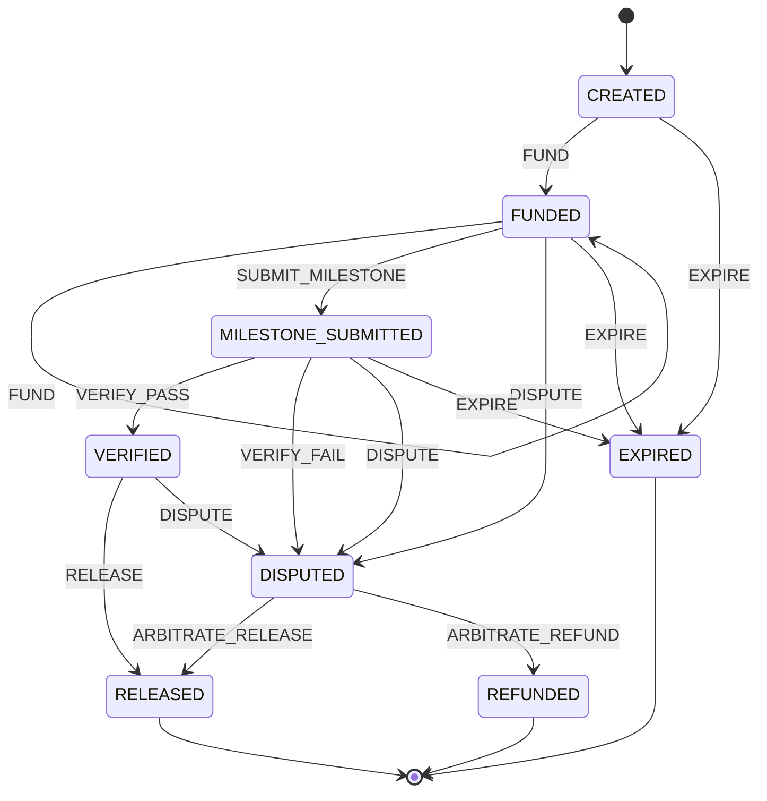

# escrow-state-machine-ts

Deterministic escrow fund-release state machine + campaign fee calculator,
reproduced from the **ALLWEB3** portfolio case study (three-sided Web3 growth
marketplace: creators, campaign managers, governance admins; escrow release
anchored to oracle-verified KPIs).

TypeScript, zero runtime dependencies. The case study's on-chain contracts are
*not* included here — this is the off-chain logic: who can move money, when,
and exactly how the numbers are computed.

## Install

Node.js ≥ 20.

```bash
npm install
npm run build
npm test   # 230 tests, all local
```

## Quickstart

```ts
import { Escrow, calculateDeposit, settleRelease } from "./dist/index.js";

// 1. Deterministic fee preview (numbers from the case study)
const fees = calculateDeposit({
  creatorPool: 10000,
  baseFee: 600,
  complexityMultiplier: 1.0,
  loyaltyDiscount: 30,
  oracleFee: 60,
});
console.log(fees.deposit); // 10630

// 2. Milestone escrow lifecycle
const escrow = new Escrow("CMP-2026-042");
escrow.dispatch("FUND", "wire received", 10630); // optional amount: FUND-only,
// validated as a finite non-negative number and recorded on the audit entry
escrow.dispatch("SUBMIT_MILESTONE", "deliverable URLs + IPFS metadata hash");
escrow.dispatch("VERIFY_PASS", "KPIs validated by oracle");
escrow.dispatch("RELEASE");
console.log(escrow.state); // RELEASED

// 3. Gross-to-net settlement on release (5% pro fee)
console.log(settleRelease({ gross: 1000, proFeeBps: 500 }));
// { gross: 1000, proFee: 50, referralCredits: 0, net: 950 }
```

## State machine



(`EXPIRE` is available from `CREATED`, `FUNDED`, and `MILESTONE_SUBMITTED`
once the campaign deadline passes — not from `VERIFIED`/`DISPUTED`, where the
outcome is decided by verification or arbitration; terminal states are
`RELEASED`, `REFUNDED`, `EXPIRED`. The diagram matches `transitionTable()` in
`src/stateMachine.ts` exactly — see `test/stateDiagram.test.ts`, which asserts
parity.)

- `transition(state, event)` is a pure function; invalid transitions throw.
- `Escrow` wraps it with an append-only history (the case study's "immutable
  operational audit log"): every dispatch records seq, event, from → to,
  timestamp, and an optional note. Each entry is also **hash-chained**:
  `prevHash` links to the previous entry's `hash` (genesis links to the
  `"GENESIS"` constant) and `hash` is SHA-256 over the canonical entry
  serialization, so a rewritten entry in a persisted JSON snapshot is
  detectable — `verifyHistoryChain(history)` returns `false`, and
  `Escrow.fromJSON()` rejects a broken chain (legacy hashless snapshots
  are still accepted and chained on rehydration; mixed chained/hashless
  snapshots are rejected). The chain is unkeyed tamper *evidence*, not a
  MAC — see [SECURITY.md](SECURITY.md) for the honest limits.
  `FUND` accepts an optional `amount`
  argument — it is validated as a finite non-negative number at the dispatch
  boundary (anything else throws) and recorded on the audit entry; passing an
  amount with any other event throws. `FUND` from `CREATED` is the initial
  deposit; `FUND` from `FUNDED` is a self-loop that adds a top-up to the
  locked total — real escrows often need extra collateral, and the locked
  total is always the *sum* of every `FUND` entry's amount (see
  `depositAmountFromHistory`).
- `allowedEvents(state)` lists valid next events for UI gating.
- Retry safety: `dispatch` accepts a fourth argument `opts` with an optional
  `idempotencyKey` (non-empty string). A dispatch whose key was already seen
  is a no-op — it returns the *current* state and appends nothing to the
  audit history, so a retried `FUND` can never double-count the deposit.
  Keys are global to the escrow instance (the same key on a different event
  is still a duplicate), are recorded only after a *successful* dispatch (a
  failed dispatch leaves the key unused, so the caller can retry with
  corrected input), and live in memory only — they are NOT part of
  `toJSON()`/`fromJSON()` snapshots, so a restart clears them and the caller
  must reconcile before replaying. This is in-process retry protection, not
  a distributed idempotency store.
- Deadlines (advisory): `escrow.setDeadline(date)` attaches a deadline
  (stored as canonical ISO-8601; unparseable input throws),
  `getDeadline()`/`clearDeadline()` read and remove it. The deadline is
  *advisory*: nothing auto-expires — a watchdog (or a human) reads
  `isOverdue(escrow)` and dispatches `EXPIRE` explicitly, so expiry stays
  auditable in the append-only history. `isOverdue()` returns false with
  no deadline and for terminal states (a settled escrow is never
  "overdue"). `expiredEscrows(escrows)` filters a batch down to the
  overdue non-terminal ones in one line — it never mutates or dispatches.
  The deadline rides along in `toJSON()`/`fromJSON()` snapshots (a
  tampered or non-canonical deadline is rejected by snapshot validation).
- Dispatch subscriptions (in-process fan-out seam): `escrow.subscribe(listener)`
  registers a listener called with `(event, from, to, entry)` after every
  *successful* dispatch, in subscription order; the returned function
  unsubscribes (idempotent). Listeners run *after* the audit entry is
  appended and can never roll it back — a throwing listener is isolated
  (its error is swallowed, remaining listeners still run, dispatch returns
  normally); pass `{ onError }` to observe those failures. The entry handed
  to listeners is a frozen, detached copy, so listeners cannot rewrite the
  audit trail. Failed dispatches and idempotency-key no-ops produce zero
  notifications. Subscriptions are in-memory only: they are NOT part of
  `toJSON()`/`fromJSON()` snapshots, and there is no durable fan-out
  (queues, webhooks, retries) — that stays the caller's infrastructure.
- Persistence-ready snapshots: `escrow.toJSON()` exports a plain-JSON
  `{ id, state, history }` snapshot (a detached deep copy;
  `JSON.stringify(escrow)` goes through it), and
  `Escrow.fromJSON(snapshot)` rebuilds a working escrow — the input is
  strictly validated as if untrusted (seq restarts at 1 with no gaps,
  from→to chain continuous from `CREATED`, every edge a legal transition,
  canonical ISO-8601 non-decreasing timestamps, `amount` finite and
  non-negative on FUND entries only); malformed snapshots throw a
  descriptive `invalid snapshot: …` error instead of yielding a corrupt
  escrow. A snapshot is an *export*, not a datastore — there is still no
  built-in storage or locking; in-memory idempotency keys are supported via
  `dispatch` options but are not part of snapshots.

## FAQ (honest)

- **Is this a smart contract?**
  No. This is pure TypeScript with zero runtime dependencies, running on
  Node.js ≥ 20. It reproduces the *off-chain* transition rules from the
  ALLWEB3 portfolio case study. There is no Solidity, no EVM bytecode, and
  no on-chain state here.

- **Where does the fee formula come from?**
  From the case study's "Deterministic Fee Calculator & Escrow Preview":
  `deposit = creatorPool + baseFee × complexityMultiplier − loyaltyDiscount + oracleFee`.
  The golden vector (10,000 / 600 / 1.0 / −30 / +60 → 10,630) is asserted by
  `test/economics.test.ts`. It is the case study's formula, not a general
  pricing engine.

- **The case study anchors settlement in Chainlink + zk-SNARK + TEE
  verification. Where is that here?**
  It isn't — deliberately. "Verification" here is the `VERIFY_PASS` event:
  dispatching it is a caller trust decision. This repo does *not* verify
  oracle signatures, zero-knowledge proofs, or TEE attestations. A production
  build would have to gate `VERIFY_PASS` on those.

  What *is* supported is an auditable opt-in: `new Escrow(id, {
  requireVerifyEvidence: true })` makes `dispatch("VERIFY_PASS")` require a
  non-empty `evidence` reference (Chainlink request ID, zk proof commitment,
  TEE quote hash — passed via `DispatchOptions.evidence`) and records it
  verbatim on the audit entry, surviving `toJSON()`/`fromJSON()` round-trips.
  It turns "someone said pass" into "someone said pass, citing X" — the
  reference is auditable but still *not* verified by the library. The flag
  is per-instance dispatch configuration and is not part of the snapshot;
  a restored escrow must re-enable it via the constructor.

- **What about the 5/9 multi-sig DAO arbitration?**
  Partially modeled: `DISPUTE` → `ARBITRATE_RELEASE` /
  `ARBITRATE_REFUND` are the arbitration outcomes, and `src/quorum.ts`
  models the *counting rule* of an M-of-N quorum (`createQuorum({ threshold,
  signers })`, idempotent `approve()`, `revoke()` before the threshold is
  reached, `hasQuorum()` — see the usage example
  in its JSDoc). `approvalLog()` records who approved and when
  (timestamps injectable via `QuorumConfig.now` for deterministic tests). `src/arbitration.ts` wires the two together:
  `dispatchArbitration(escrow, quorum, outcome)` refuses to dispatch until
  `hasQuorum()` is true and auto-records `quorum <approvals>/<threshold>`
  in the audit note. There is still no signature verification, no key
  management, and no DAO governance in this repo — recording approvals is a
  caller trust decision, exactly like `VERIFY_PASS`. Production would need
  the approvals wired to real signatures.

- **How precise is the money math?**
  All amounts are rounded to cents (`round2`). Invariant tests assert fund
  conservation within ±1 cent. This is not big-decimal arithmetic and has
  not been audited.

- **Can I use this in production?**
  No. `Escrow` is in-memory with no built-in store (snapshots are a JSON
  export via `toJSON()`/`Escrow.fromJSON()`, not a database), no concurrency
  control, idempotency keys only in-memory (not persisted across restarts),
  `EXPIRE` is dispatched by the caller — there is an advisory deadline
  field plus `isOverdue()`/`expiredEscrows()` watchdog helpers, but no
  background timer or auto-expiry — and there is no identity/RBAC.
  Reference and demo use only.

## Limitations (honest)

- **Off-chain reproduction only.** The case study anchors settlement in smart
  contracts (Chainlink + zk-SNARK + TEE verification, 5/9 Safe multi-sig
  arbitration). None of that is implemented here — this models the *rules*,
  not the chain.
- **Simplified roles.** Real deployments need identity/RBAC, a real deadline
  scheduler (this repo has an advisory deadline field with
  `isOverdue()`/`expiredEscrows()` watchdog helpers, but no background
  timer or auto-expire), and cross-restart idempotency keys (this repo's
  are in-memory only); the `Escrow` class is in-memory.
- **Fee formula is the case study's**, not a general pricing engine: arbitrary
  fee schedules are out of scope.
- **Trust boundaries.** What the library enforces (money input validation,
  fail-closed constant-time webhook verification, strict snapshot validation)
  versus what stays the caller's responsibility (quorum approvals have no
  signature verification, webhook secret distribution, cents-rounding money
  math) is documented in [SECURITY.md](SECURITY.md) — every statement there
  is verifiable against the source.

## Webhooks

Settled escrows can be pushed to accounting/bookkeeping systems as signed
webhook notifications:

```ts
import {
  buildSettlementReport,
  buildSettlementWebhook,
  verifySettlementWebhook,
} from "escrow-state-machine-ts";

const report = buildSettlementReport({ /* escrowId, history, finalState, deposit, settlement */ });
const { payload, signature } = buildSettlementWebhook(report, { secret: process.env.WEBHOOK_SECRET! });
// POST payload as JSON with header `X-Signature: signature` (shape: `sha256=<hex>`).

// On the receiving end, verify over the raw body bytes:
const ok = verifySettlementWebhook(rawBody, receivedSignature, secret);
```

`payload` is `{ event: "escrow.settled", escrowId, outcome, deposit, parties, at }`,
derived entirely from the audit-backed settlement report. The comparison is
constant-time (`timingSafeEqual`); malformed signatures fail closed as
`false`, never throw.

Secret rotation: while you roll from an old secret to a new one, pass both
as candidates — any candidate that matches verifies, all-mismatch still
fails closed:

```ts
const ok = verifySettlementWebhook(rawBody, receivedSignature, {
  secrets: [process.env.WEBHOOK_SECRET_NEW!, process.env.WEBHOOK_SECRET_OLD!],
});
```

An empty `secrets` array (or an empty secret inside it) is a caller
configuration error and throws instead of silently passing. The library does
not generate, store, or schedule the rotation itself — it only accepts the
candidate set the caller hands it (see [SECURITY.md](SECURITY.md)).

Delivery is handled by `deliverSettlementWebhook(url, webhook, options)` —
still zero runtime dependencies (Node ≥ 20 global `fetch`):

```ts
import { deliverSettlementWebhook } from "escrow-state-machine-ts";

const result = await deliverSettlementWebhook(
  "https://ledger.example.com/hooks/escrow",
  { payload, signature },
  { retries: 3, backoffMs: 1000, timeoutMs: 10000 }, // all optional; these are the defaults
});
// result: { status: 200, attempts: 1 }
```

Semantics: the payload is POSTed as JSON with the `X-Signature` header,
byte-identical to what `buildSettlementWebhook` signed so the receiver can
verify it over the raw body. 2xx returns `{ status, attempts }`; 429, 5xx,
and network errors (including timeouts) are retried with exponential backoff
(retry n waits `backoffMs * 2^(n-1)`). A 429 `Retry-After` response header
(delay seconds or an HTTP-date) takes precedence over the backoff; an
absent or unparsable value falls back to it. Other 3xx/4xx throw
immediately without retrying, and redirects are never followed: a 3xx
response is returned as-is (the signed payload is never re-posted to a
third-party redirect target), surfacing as `failed with status 301 (not
retried)` so the caller fixes the endpoint URL. When every attempt fails, the error reads
`webhook delivery to <url> failed after <n> attempts: <last cause>`; a
per-attempt timeout surfaces as `timed out after <timeoutMs>ms`. Secret
distribution remains the caller's responsibility: whoever holds it can forge
signatures.

## Reproducibility

`npm test` runs 230 tests, including the portfolio's exact fee numbers as a
golden vector (10,000 / 600 / 1.0x / −30 / +60 → 10,630). No network, no
randomness in assertions.

## License

MIT
